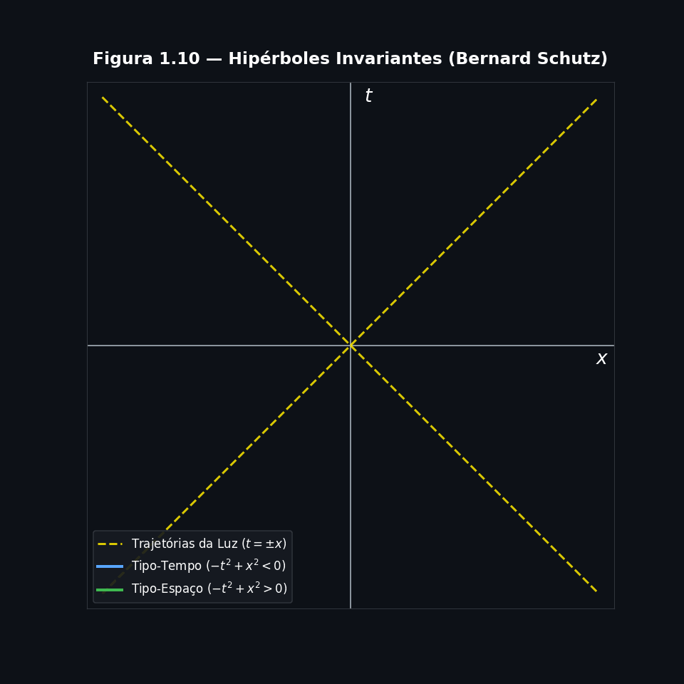
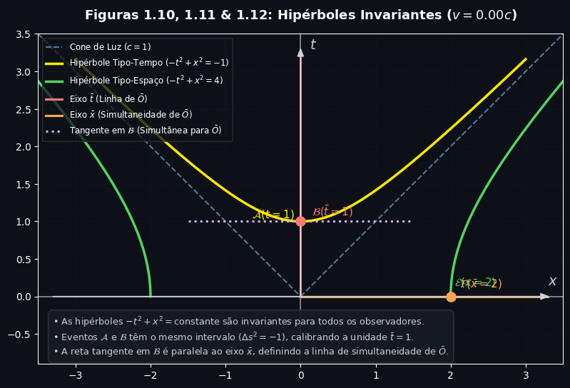
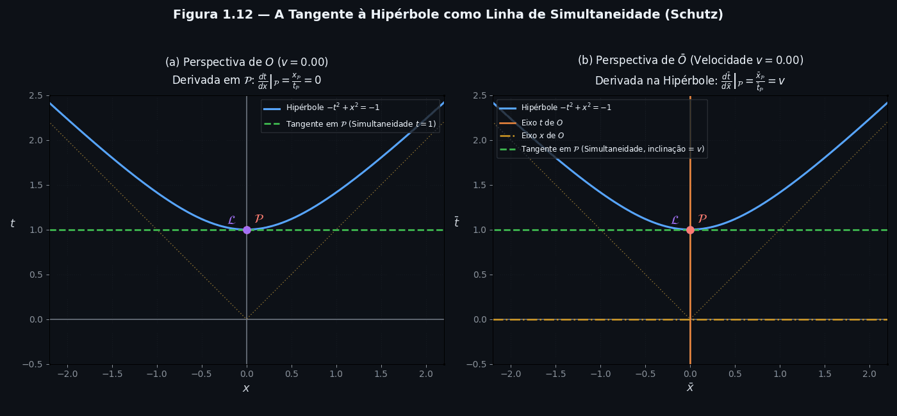
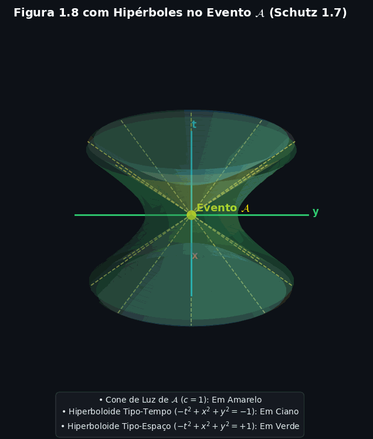

# Geometria das Hipérboles Invariantes e Calibração de Eixos
 
*Seções 1.7 de Bernard Schutz: a régua geométrica que faltava, a hipérbole.
 
> **Antes de começar:** este post é a continuação de [Invariância do Intervalo](https://github.com/m0rang0azul/invariancia-do-intervalo), onde vimos que $\Delta s^2 = \Delta \bar s^2$ para qualquer par de eventos, em qualquer referencial inercial. Aqui usamos essa invariância para, finalmente, calibrar os eixos inclinados $\bar t, \bar x$ que construímos em [Geometria do Espaço-Tempo](https://github.com/m0rang0azul/Relatividade-Geral---Diagrama-de-Minkowski).

## 1. O Intervalo Invariante no Espaço-Tempo

Vimos que o intervalo $\Delta s^2$ espaço-temporal é uma quantidade invariante para dois ou mais observadores inerciais ($O$ e $\bar O$). No espaço-tempo quadridimensional, ele é definido como:

$$ \Delta s^2 \equiv -(\Delta t)^2 + (\Delta x)^2 + (\Delta y)^2 + (\Delta z)^2 $$

Para facilitar a visualização geométrica, restringimos nossa análise ao plano $t-x$ do observador $O$. Assim, os deslocamentos nos eixos $y$ e $z$ são nulos ($\Delta y = \Delta z = 0$). Portanto, o intervalo se simplifica para:

$$ \Delta s^2 \equiv -(\Delta t)^2 + (\Delta x)^2 $$

## 2. Equações das Hipérboles Invariantes

Considere um evento qualquer $A(t, x)$ a uma distância da origem $O(0,0)$ no plano t-x. O intervalo entre esses dois pontos é dada por:

$$ -(t-0)^2 + (x-0)^2 = \Delta s^2 \equiv a^2 $$
$$ -t^2 + x^2 = a^2 $$

Quando $\Delta s^2 > 0$ dizemos que a hipérbole que passa pelo ponto $A(t, x)$ é do tipo espaço. Desta forma, a equação acima é uma **hipérbole do tipo espaço** no referencial $O$, pois $a^2 > 0$. Mas o que acontece quando $\Delta s^2 < 0$? 

Da mesma forma, vamos considerar um evento $B(t, x)$ cujo intervalo é negativo:

$$ -t^2 + x^2 = -b^2 $$

Quando $\Delta s^2 < 0$ dizemos que a hipérbole que passa pelo ponto $B(t, x)$ é do tipo tempo. Assim, dizemos que a equação acima é uma **hipérbole do tipo tempo** no referencial $O$, pois $-b^2 < 0$.

Como o intervalo $\Delta s^2$ é invariante, as equações acima devem valer para *qualquer* observador. Portanto, para um observador $\bar{O}$ a uma velocidade $v$ em relação a $O$, os mesmos eventos estarão sobre as curvas:

$$ -\bar{t}^2 + \bar{x}^2 = a^2 \quad \text{(tipo espaço $\Delta s^2 > 0$)} $$
$$ -\bar{t}^2 + \bar{x}^2 = -b^2 \quad \text{(tipo tempo $\Delta s^2 < 0$)} $$

  

## 3. Calibração dos Eixos de $\bar{O}$ usando Hipérboles

Para entender a escala dos eixos do referencial em movimento ($\bar{O}$), usamos essas hipérboles como "réguas" padrão. Vamos adotar os valores $b=1$ (para a hipérbole do tipo tempo) e $a=2$ (para a hipérbole do tipo espaço).

- **Evento $\mathcal{A}$ (Calibrando o eixo $t$):**
Quando o evento $\mathcal{A}$ está sobre o eixo $t$ do referencial $O$, temos, $x = 0$. Substituindo na equação da hipérbole do tipo   tempo:
  
$$
-t^2 + 0^2 = -1 \Rightarrow t = 1
$$
  
Isso significa que o evento $\mathcal{A}$ ocorre em $t=1$.

- **Evento $\mathcal{B}$ (Calibrando o eixo $\bar{t}$):**
Quando o evento $\mathcal{B}$ está sobre o eixo $\bar{t}$ do referencial $\bar{O}$, temos, $\bar{x} = 0$. Pela invariância do intervalo, ele também está sobre a mesma hipérbole:
  
$$
-\bar{t}^2 + \bar{x}^2 = -1
$$
  
$$
-\bar{t}^2 + 0^2 = -1 \Rightarrow \bar{t} = 1
$$
  
Assim, calibramos o eixo temporal de $\bar{O}$.

- **Eventos $\mathcal{E}$ e $\mathcal{F}$ (Calibrando os eixos espaciais):**
  Para calibrar os eixos espaciais, usamos a hipérbole do tipo espaço:

$$
-t^2 + x^2 = 2^2 = 4
$$

  No eixo $x$ de $O$ (onde $t=0$), temos o evento $\mathcal{E}$:

$$
0^2 + x^2 = 4 \Rightarrow x = 2
$$

  No eixo $\bar{x}$ de $\bar{O}$ (onde $\bar{t}=0$), temos o evento $\mathcal{F}$:

$$
-\bar{t}^2 + \bar{x}^2 = 4 \Rightarrow \bar{x} = 2
$$

  Este tipo de hipérbole calibra os eixos espaciais de $\bar{O}$.

  

## 4. Interpretação Física e a Quebra da Intuição Euclidiana

Ao observar o diagrama espaço-temporal, o evento $\mathcal{B}$ pode parecer geometricamente "mais distante" da origem do que o evento $\mathcal{A}$. No entanto, isso revela a inadequação de usar a intuição baseada na geometria euclidiana para o espaço-tempo.

A quantidade física fundamental aqui é o intervalo $\Delta s^2 = -(\Delta t)^2 + (\Delta x)^2$, e não a distância euclidiana $\Delta t^2 + \Delta x^2$. Na Relatividade Restrita, precisamos adaptar nossa intuição e usar $\Delta s^2$ como a medida física de "distância" no espaço-tempo.

Essa distinção é crucial: a experiência cotidiana nos diz que o espaço é euclidiano (para eventos simultâneos, onde $\Delta t = 0$, o intervalo se reduz a $\Delta s^2 = (\Delta x)^2 + (\Delta y)^2 + (\Delta z)^2$, que é a distância euclidiana padrão). O novo elemento da Relatividade é que o tempo entra no cálculo da distância com sinal oposto ao espaço.

### Exemplo:

Quando desenhamos um diagrama espaço-temporal em um papel, estamos usando uma folha euclidiana para representar um espaço que não é euclidiano. Para entender essa distinção, vamos usar um exemplo prático.

Imagine que o observador $\bar{O}$ está se movendo para a direita com uma velocidade $v$ em relação ao observador $O$.

- O evento $\mathcal{A}$ está sobre o eixo $t$ do referencial parado ($O$). Suas coordenadas são $t=1, x=0$.
- O evento $\mathcal{B}$ está sobre o eixo $\bar{t}$ do referencial em movimento ($\bar{O}$). No referencial de $\bar{O}$, suas coordenadas são $\bar{t}=1, \bar{x}=0$. 

Para descobrir onde o evento $\mathcal{B}$ está no gráfico de $O$, precisamos cruzar a linha do eixo $\bar{t}$ com a hipérbole invariante. Graficamente, supondo as coordenadas aproximadas de $t \approx 1.15$ e $x \approx 0.58$ no referencial $O$.

### A Armadilha da Intuição Euclidiana

Agora, se você olhar para o gráfico e usar a intuição euclidiana (como se estivesse medindo com uma régua no papel), a distância do evento $\mathcal{B}$ até a origem será:

$$
d_{\mathcal{B}} = \sqrt{t^2 + x^2} \approx \sqrt{1.15^2 + 0.58^2} \approx \sqrt{1.32 + 0.33} \approx 1.28
$$

Enquanto a distância do evento $\mathcal{A}$ até a origem será:

$$
d_{\mathcal{A}} = \sqrt{t^2 + x^2} = \sqrt{1^2 + 0^2} = 1
$$

**Visualmente, no papel, o evento $\mathcal{B}$ parece "mais longe" da origem do que o evento $\mathcal{A}$.** Se você usasse uma régua comum, diria que $\mathcal{B}$ está fisicamente mais distante. 

No entanto, essa é uma armadilha. Na Relatividade, a "distância" física real não é a distância euclidiana, mas sim o **Intervalo Espaço-Temporal** ($\Delta s^2$), que possui um sinal negativo no termo temporal. Apesar de $\mathcal{B}$ parecer mais longe no desenho, o intervalo espaço-temporal de ambos os eventos é exatamente o mesmo ($\Delta s^2 = -1$), pois ambos estão sobre a mesma hipérbole invariante. A intuição euclidiana, portanto, nos engana ao interpretar diagramas de Minkowski.

Usando as coordenadas que obtivemos no referencial $O$:

- **Evento $\mathcal{A}$:** $\Delta s^2 = -(1)^2 + (0)^2 = -1$
- **Evento $\mathcal{B}$:** $\Delta s^2 = -(1.15)^2 + (0.58)^2 \approx -1.32 + 0.33 \approx -1$

Apesar do evento $\mathcal{B}$ parecer "mais longe" no desenho euclidiano, o intervalo espaço-temporal dele é **exatamente o mesmo** que o do evento $\mathcal{A}$ (ambos resultam em $-1$). Isso não é coincidência: ambos os eventos estão sobre a mesma **hipérbole invariante** no diagrama.

Na geometria euclidiana, pontos com a mesma distância da origem formam um **círculo**. Já na geometria do espaço-tempo de Minkowski, eventos com o mesmo intervalo formam uma **hipérbole**. 

Portanto, **não se pode usar uma régua comum para medir distâncias em um diagrama espaço-temporal**. A "régua" correta é o intervalo $\Delta s^2$. Quando olhamos para o diagrama, nossos olhos veem a hipérbole como uma curva, mas nosso cérebro tenta aplicar a lógica de círculos (distância euclidiana). É por isso que precisamos adaptar nossa intuição e aprender a usar $\Delta s^2$ como a medida física de "distância" no espaço-tempo, deixando de lado a intuição baseada na geometria euclidiana.

## 5. Propriedade das Tangentes (Linhas de Simultaneidade)

Por fim, uma propriedade importante das hipérboles para deduzir a dilatação do tempo e a contração de Lorentz: a tangente a uma hipérbole em qualquer evento $\mathcal{P}$ é uma linha de simultaneidade do referencial inercial cujo eixo do tempo conecta $\mathcal{P}$ à origem. Se este referencial tem velocidade $v$, a tangente tem inclinação $v$. Isso mostra geometricamente como diferentes observadores identificam diferentes conjuntos de eventos como simultâneos.

  

  

---

## Referências

- SCHUTZ, Bernard. *A First Course in General Relativity*. 3ª ed. Cambridge: Cambridge University Press, 2022. Capítulo 1, Seção 1.6.

---

*Post baseado no experimento mental do relógio de luz e nos diagramas de Minkowski, seguindo a abordagem do livro de Bernard Schutz, "A First Course in General Relativity".*
